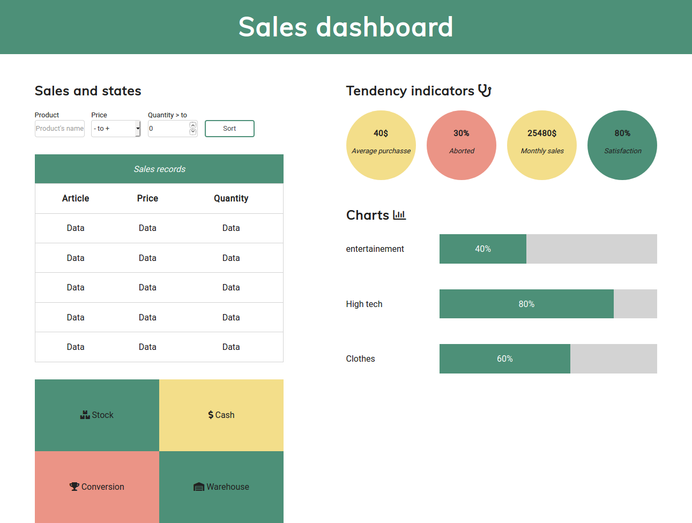

# Dashboard pour la gestion de données

Le wireframe et la maquette sont dans le dossier img

Il s'agit d'un projet produit dans le cadre de mon poste en tant que formateur en développement web. Ce projet a pour but de permettre aux étudiants de mettre en oeuvre les concepts en HTML et CSS qu'ils viennent de découvrir et ainsi d'apprendre à produire des interfaces graphiques pour le web. A ce stade de la formation les interfaces ne sont pas encore responsives.

Au travers de cet exercice, ils apprennent à :
- Utiliser une base boilerplate
- Positionner des éléments grâce à flexbox
- Réaliser des formulaires HTML
- Réaliser des tableaux HTML
- Réaliser des mises en forme complexes
- Gérer les couleurs
- Intégrer des librairies à leurs projets
- Optimiser le CSS avec DRY
- Mettre en place des classes utilitaires

## Consignes

Intégrateur dans une société d'analyse de données, l'équipe a pensé à une nouvelle manière de présenter les données. Après concertation une nouvelle version du tableau de bord pour la gestion des données a été conçue. Le graphiste de l'entreprise a produit une maquette que voici :

Votre rôle est d'utiliser vos compétences en HTML et CSS pour reproduire le plus fidèlement possible la maquette qui vous a été donnée.

Spécifications techniques :
- HTML5
- CSS3
- Positionnement avec flexbox
- Mise en place du principe DRY
- Google fonts pour les polices
- Font awesome pour les icônes
